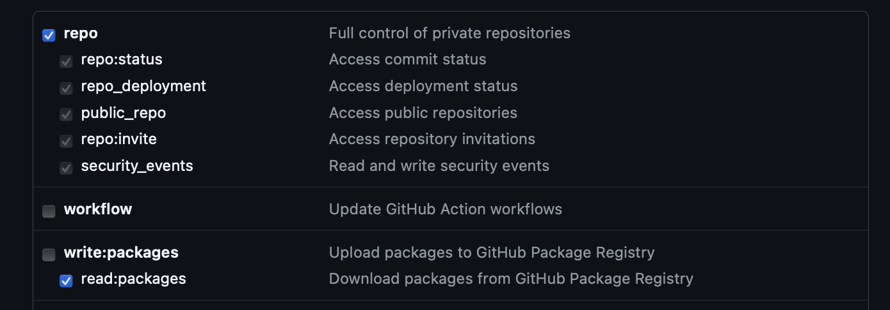
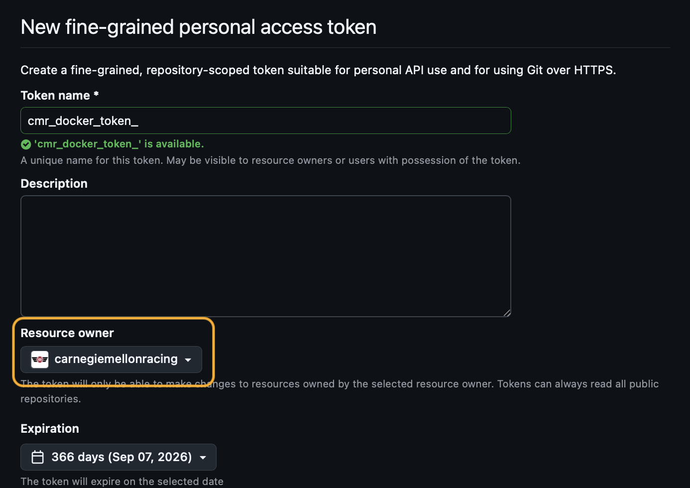
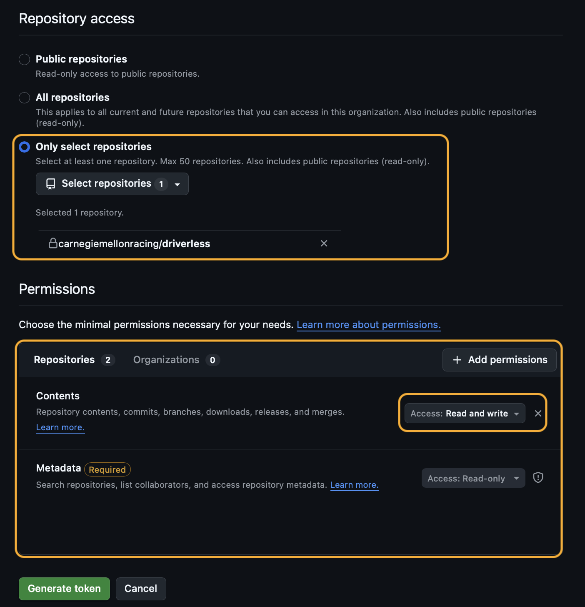
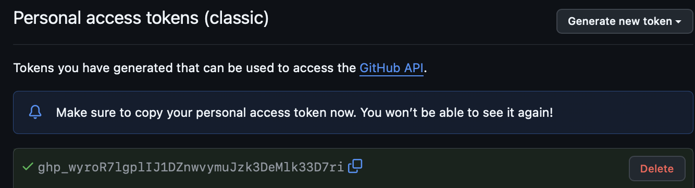
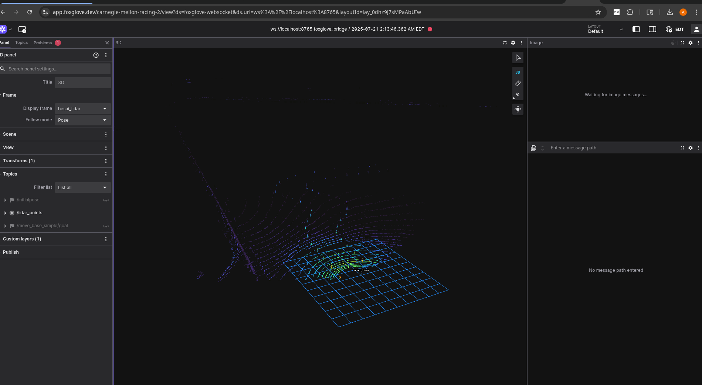
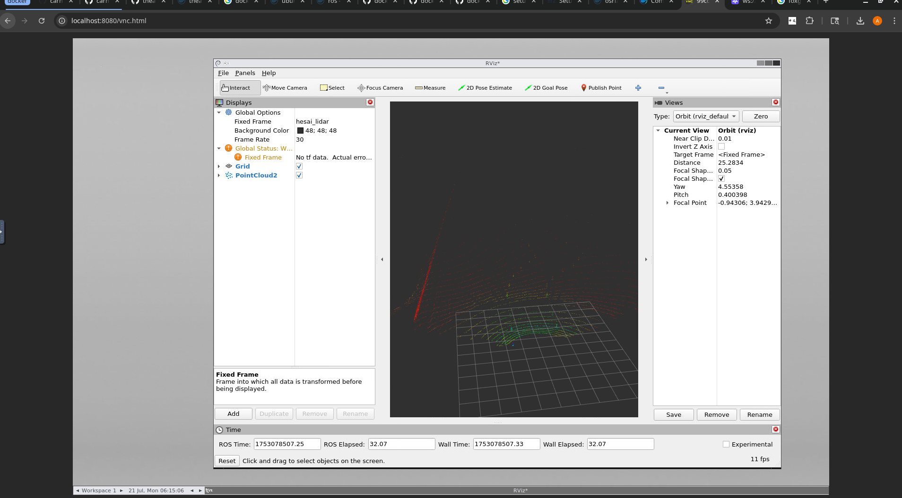

# driverless-docker

> [!NOTE]
> If you have issues in any step of the following procedure, please check [issues that have already been solved](https://github.com/carnegiemellonracing/driverless-docker/issues?q=is%3Aissue)

## Table of Contents

* [What is Docker / Why do we use it?](#what-is-docker--why-do-we-use-it)
* [Prerequisites](#prerequisites)
* [To clone the repository](#to-clone-the-repository)
* [Git Authentication](#authentication)
    * [Generate a Personal Access Token](#generate-a-personal-access-token)
* [To build / run the Docker container](#to-build--run-the-docker-container)
    * [Without SLAM Package](#without-slam-package)
    * [With ML-Dev Container](#with-ml-dev-container)
    * [With SLAM Package](#with-slam-package)
* [To run scripts from the container (attach interactive shell to container)](#to-run-scripts-from-the-container-attach-interactive-shell-to-container)
* [To rebuild the Docker container](#to-rebuild-the-docker-container)
* [Visualization](#visualization)
    * [Foxglove](#foxglove)
    * [RVIZ / RQT\_GRAPH / Desktop-related stuff, e.g., matplotlib...](#rviz--rqt_graph--desktop-related-stuff-eg-matplotlib)


## What is Docker / Why do we use it?

Check out [this](https://docs.google.com/presentation/d/1i58fbb-e5uO1mVOff-ncIiogv28kOKN-KCW4cd_dVA8/edit?usp=sharing) google slide deck for more info (need access to CMR GDrive)

Docker is a way to manage "containers" of software. These "containers" are simply a set of packages and files (could be as simple as a single executable or as complex as an operating system with a Python and c++ installation and various files and programs).

It allows you to quickly get started working with Git, ROS2, CMR Pipelines, etc… Don't have to worry about installing and fixing all of the dependencies!

Essentially, we use Docker for a few reasons:
- Standard development environment
    - Packages, OS, etc… allows us to run our codebase under a set of “standard conditions”
    - GitHub Repository (our codebase) 
- Convenience
    - **You can start a container on your laptop, a random PC, or any other device and have access to the versions, packages, etc… that you need!** 

## Prerequisites:
install docker for your machine.
[Docker desktop](https://docs.docker.com/desktop/) recommended, as it has multiple useful tools (e.g., GUI, docker compose, etc...)

> [!WARNING]
> There are a few potential pitfalls when installing docker desktop. This list below is not comprehensive, but we will aim to update it as new issues/solutions are found:
>
> 1. For Linux Users, ensure that you add your user to the docker group at the end of setup (see [docker guide](https://docs.docker.com/engine/install/linux-postinstall/)). This will ensure you're running the container with the correct permissions! (see [issue](https://github.com/carnegiemellonracing/driverless-docker/issues/4))
> 2. For MacOS users ensure rosetta setting in docker desktop is unchecked (see [issue](https://github.com/carnegiemellonracing/driverless-docker/issues/1))

it is also recommended to install Visual Studio Code (VSCode) along with the Dev Containers extension to work with the docker container

## To clone the repository:
```bash
git clone https://github.com/carnegiemellonracing/driverless-docker.git
```


## Authentication

*Now that CMR Driverless is a private repository we need to authenticate via [personal access tokens](https://docs.github.com/en/authentication/keeping-your-account-and-data-secure/managing-your-personal-access-tokens#about-personal-access-tokens)*

#### Generate a Personal Access Token
- Go to [GitHub](https://github.com/settings/tokens) (GitHub -> Settings -> Developer Settings -> Personal Access Tokens)
- You can use either Classic or Fine-Grained Tokens. *You may not have access to fine-grained tokens for the CMR organization*
    - Classic: Ensure the following are selected (add write:packages if you have access / need it)

    

    - Fine-Grained: Ensure the following are selected (add write:packages if you have access / need it)

    

    

    
    *don't try this token...*

- Copy the token and export to your terminal where you cloned the driverless-docker repo as a new local variable.

> [!IMPORTANT]
>   ```bash 
>   # Make sure to paste your token / username instead of the bracketed text
>   export GITHUB_PAT="<YOUR TOKEN HERE>"
>   export GH_USER="<YOUR GITHUB USERNAME>"
>   ```
    
    
## To build / run the Docker container:

#### Without SLAM Package or ML-Dev Container
```bash
cd driverless-docker
docker compose up
```

#### With ML-Dev Container
```bash
cd driverless docker
docker compose --profile ml-dev up
```

> [!TIP]
> If it doesn't work immediately, try running the compose command with the additional --build flag. 
>
> ```bash docker compose --profile ml-dev up --build``` 

#### With SLAM Package
> [!WARNING]
> This can add 1+ hrs to the container build time. Only proceed if you need to run path planning modules.

1. Using your choice of text editor, open the Dockerfile located in the root directory of this project
2. Uncomment out the following [line](https://github.com/carnegiemellonracing/driverless-docker/blob/main/Dockerfile#L13)
``` ruby [comment]: <> (this is just for color LOL)
8 # RUN /setup.sh -p
```
3. Comment out the following [line](https://github.com/carnegiemellonracing/driverless-docker/blob/main/Dockerfile#L16-L17)
``` ruby
11 RUN /setup.sh 
```
<br />

```bash
cd driverless-docker
docker compose up
```

> [!NOTE]
> run `docker compose up -d` if you want to run the node in detached mode in the background. You can always turn it off from docker desktop, VSCode, or the CLI.

## To run scripts from the container (attach interactive shell to container)
```bash
docker exec -it driverless-docker-26x-1 /bin/bash
```

- Note: Would also run with dev-containers extension with vscode

## Authentication within Docker
*Once Docker is setup and you are in, you may need to authenticate your GitHub account to retain write perms. This is easily done using the github cli*

```bash
# within the docker container 
gh auth login
```

## To rebuild the Docker container:

> [!NOTE]
> This is only required if you make a change in the `Dockerfile` or the `docker-compose.yaml`

```bash 
docker compose up --build
```

## Visualization

### Foxglove
1. Open a terminal and attach to container. Run:

    ```bash 
    docker exec -it driverless-docker-26x-1 /bin/bash
    ros2 launch foxglove_bridge foxglove_bridge_launch.xml
    ```
2. In a browser of your choice, go to [app.foxglove.dev](app.foxglove.dev) and make and account / sign in
3. Open a new connnection to ws://localhost:8765
4. Do stuff!



### RVIZ / RQT_GRAPH / Desktop-related stuff, e.g., matplotlib...
1. open a tab in your browser of choice at localhost:8080
Click on `vnc.html`
    - This opens an Ubuntu desktop
2. when you run commands with viz, such as `rviz2`, `rqt_graph`, etc... it will show up in the desktop instance running in the browser tab


