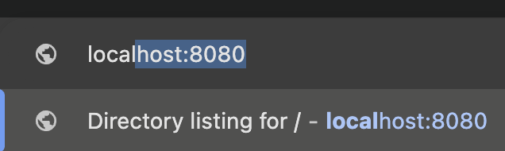
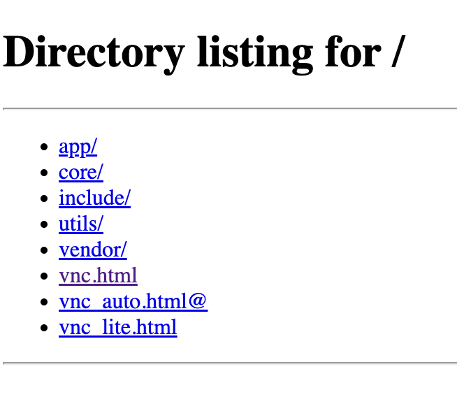

# Data Visualization Tutorial

> [!NOTE]
> This is a supplement to the main setup instructions housed in the [README.md](README.md) file. Ensure that before starting, you have access to your docker environment.

## What / How are we Visualizing?

We have two extremely useful debugging tools hooked up to the docker containers. Each has different uses:

1. Full desktop emulator; this looks and functions like a desktop GUI

    *You can use the desktop for all sorts of debugging, from displaying recorded camera data with OpenCV to plotting and viewing MatPlotLib graphs. This behaves like a normal desktop and most apps that can be launched from the command line, including RVIZ2, RQT_Graph, etc... can be used.*

2. Foxglove ROS2 display

    *Foxglove is our primary visualization suite for all topics broadcasted on our ROS2 network. We can use it to visualize LiDAR point clouds, camera frames, algorithm intermediate steps, cone locations, and much much more. If you work with ROS on our system, you'll definitely be glad to use Foxglove!*


## Prerequisites
- Docker container set up (running in the background with -d flag)
    - Note: this means that you have been added to the Driverless GitHub already
- Access to the CMR GDrive
- VSCode attached to your docker container (Recommended)

## Setting up Foxglove

1. Run the Foxglove "bridge" package (takes ROS2 topics and bundles them via websocket to Foxglove frontend)
<details>
<summary>If you don't have / want VSCode setup<summary>

1. Open a terminal and attach to container. Run:

```bash
$ docker exec -it driverless-docker-26x-1 /bin/bash
$ ros2 launch foxglove_bridge foxglove_bridge_launch.xml
```
</details>

<details>
<summary>If you have VSCode set up<summary>

1. Open a terminal in VSCode. Run:

> [!IMPORTANT]
> You should already be in the container because you launched from VSCode. If you want 

```bash
$ ros2 launch foxglove_bridge foxglove_bridge_launch.xml
```

> [!NOTE]
> - This will now run a ROS node in the terminal. Don't close the terminal or shut it off or you'll lose the connection
> - Errors in this terminal aren't usually indicitive of a major problem

</details>

2. In a browser of your choice, go to [app.foxglove.dev](app.foxglove.dev) and make an account / sign in
3. Open a new connnection to ws://localhost:8765
4. Do stuff!


## Setting Up Desktop RVIZ / RQT_GRAPH / Desktop-related stuff, e.g., matplotlib...

1. open a tab in your browser of choice at `localhost:8080`
   Click on `vnc.html` - This opens an Ubuntu desktop




2. when you run commands with viz, such as `rviz2`, `rqt_graph`, etc... it will show up in the desktop instance running in the browser tab

3. If you're familiar with MatPlotLib and Python, try showing a quick graph to test as well!


## Running Rosbag Data and Visualizing Output

- Not Yet Written
